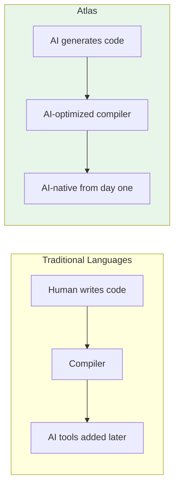
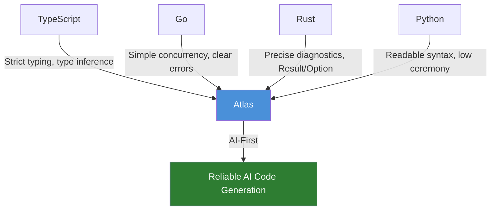
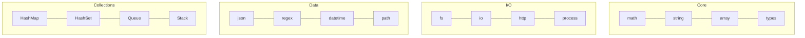
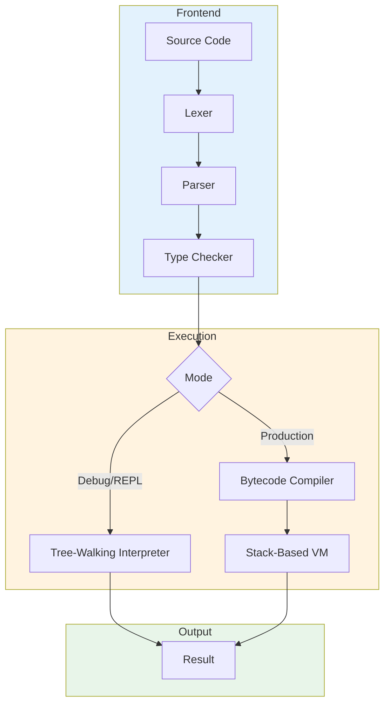
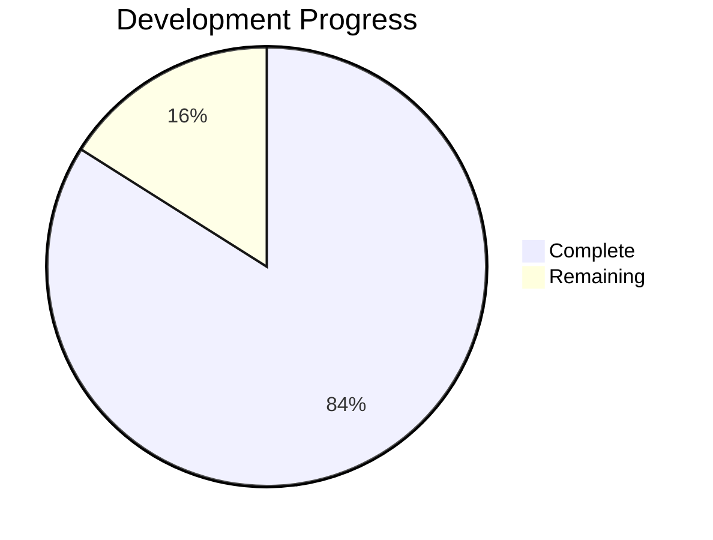

<div align="center">

# Atlas

### The AI-First Programming Language

**Designed for AI code generation. Built entirely by AI.**

[](https://github.com/proxikal/atlas/actions/workflows/ci.yml)
[](LICENSE)
[](https://www.rust-lang.org/)
[](#metrics)
[](#metrics)

</div>

---

## Why Atlas?

**Other programming languages were built before AI existed.** They're being retrofitted with AI tooling as an afterthought.

**Atlas is different.** Every design decision asks: *"What's best for AI?"*



**The result:** A language that AI agents can generate, analyze, and debug with unprecedented reliability.

---

## Table of Contents

- [AI-First Design](#ai-first-design)
- [Best of All Worlds](#best-of-all-worlds)
- [Quick Start](#quick-start)
- [Language Features](#language-features)
- [Standard Library](#standard-library)
- [Architecture](#architecture)
- [For AI Developers](#for-ai-developers)
- [Metrics](#metrics)
- [Documentation](#documentation)
- [License](#license)

---

## AI-First Design

Atlas treats AI agents as **first-class consumers**, not an afterthought.

### What This Means in Practice

| Traditional Languages | Atlas |
|----------------------|-------|
| Implicit type coercion | **No implicit conversions** - deterministic behavior |
| Truthy/falsy values | **Explicit booleans only** - no guessing |
| Ambiguous error messages | **Precise diagnostics** - file, line, column, span |
| Human-readable errors only | **JSON diagnostic output** - machine-parseable |
| IDE tooling for humans | **AI-native LSP** - structured access for agents |

### AI-Optimized Syntax

Atlas syntax is designed for **reliable code generation**:

```typescript
// No ambiguity - every type is explicit
fn divide(a: number, b: number) -> Result<number, string> {
    if (b == 0) {
        return Err("division by zero");
    }
    return Ok(a / b);
}

// Pattern matching for safe error handling
match divide(10, 2) {
    Ok(value) => print("Result: " + str(value)),
    Err(error) => print("Error: " + error)
}
```

**Why this matters for AI:**
- No implicit behaviors to hallucinate
- Type errors caught at compile time, not runtime
- Consistent patterns across the entire codebase

### 100% AI-Developed

Atlas itself is built entirely through **human-AI collaboration** - a proof of concept that AI can produce production-quality compiler infrastructure when given the right architecture.

---

## Best of All Worlds

Atlas cherry-picks proven ideas from the best languages:



| Feature | Inspiration | Atlas Implementation |
|---------|-------------|---------------------|
| **Strict Typing** | TypeScript | Explicit types, no implicit `any`, full inference |
| **Error Handling** | Rust | `Result<T, E>` and `Option<T>` with pattern matching |
| **Concurrency** | Go | `spawn` + `chan<T>` (planned) |
| **Diagnostics** | Rust | Precise spans, structured errors, actionable hints |
| **Readability** | Python | Low-ceremony syntax, natural for humans and AI |
| **Collections** | Multiple | Thread-safe HashMap, HashSet, Queue, Stack |

**What Atlas avoids:**
- No implicit coercion (JavaScript)
- No null pointer exceptions (Java)
- No complex lifetime annotations (Rust)
- No significant whitespace (Python)

---

## Quick Start

```bash
# Clone and build
git clone https://github.com/proxikal/atlas.git
cd atlas && cargo build --release

# Run the REPL
./target/release/atlas

# Run a program
./target/release/atlas run examples/vm/fibonacci.atlas
```

**REPL session:**
```
atlas> let numbers = [1, 2, 3, 4, 5];
atlas> let doubled = map(numbers, fn(x: number) -> number { return x * 2; });
atlas> print(doubled);
[2, 4, 6, 8, 10]
```

---

## Language Features

### Type System

```typescript
// Primitives
let n: number = 42;              // 64-bit float (IEEE 754)
let s: string = "hello";         // UTF-8 string
let b: bool = true;              // Boolean
let nothing: null = null;        // Explicit absence

// Generics
let maybe: Option<number> = Some(42);
let result: Result<string, string> = Ok("success");

// Collections (thread-safe)
let arr = [1, 2, 3];
let map = hashmap_new();
let set = hashset_new();
```

### Functions

```typescript
// First-class functions with explicit types
fn add(a: number, b: number) -> number {
    return a + b;
}

// Generic functions
fn identity<T>(x: T) -> T {
    return x;
}

// Higher-order functions
fn apply(f: (number) -> number, x: number) -> number {
    return f(x);
}
```

### Control Flow

```typescript
// Pattern matching (exhaustiveness checked)
match result {
    Ok(value) => process(value),
    Err(error) => handle(error)
}

// For-in iteration
for item in items {
    print(item);
}

// Standard loops
while (condition) { /* ... */ }
for (var i = 0; i < 10; i++) { /* ... */ }
```

### Modules

```typescript
// math.atl
export fn add(a: number, b: number) -> number {
    return a + b;
}
export let PI = 3.14159;

// main.atl
import { add, PI } from "./math";
import * as math from "./math";
```

---

## Standard Library

200+ functions across 18 modules:



| Module | Functions | Examples |
|--------|-----------|----------|
| **math** | 20+ | `abs`, `sqrt`, `pow`, `sin`, `cos`, `floor`, `ceil`, `round`, `min`, `max` |
| **string** | 25+ | `len`, `substr`, `split`, `join`, `trim`, `upper`, `lower`, `replace`, `contains` |
| **array** | 20+ | `push`, `pop`, `slice`, `map`, `filter`, `reduce`, `sort`, `reverse`, `find` |
| **json** | 10+ | `json_parse`, `json_stringify`, `json_get`, `json_set` |
| **regex** | 8+ | `regex_new`, `regex_match`, `regex_find_all`, `regex_replace` |
| **datetime** | 15+ | `now`, `format_datetime`, `parse_datetime`, `add_days` |
| **http** | 5+ | `http_get`, `http_post`, `http_request` |
| **fs** | 15+ | `read_file`, `write_file`, `file_exists`, `list_dir`, `mkdir` |

---

## Architecture

Atlas features **dual execution engines** with 100% behavioral parity:



### Workspace Structure

| Crate | Purpose | Status |
|-------|---------|--------|
| `atlas-runtime` | Lexer, parser, type checker, compiler, VM, interpreter, stdlib | Complete |
| `atlas-cli` | REPL, file runner, developer tools | Complete |
| `atlas-formatter` | Code formatter | Complete |
| `atlas-lsp` | Language Server Protocol for editors/AI | In Progress |
| `atlas-config` | Project configuration | Complete |
| `atlas-build` | Build system | Complete |
| `atlas-package` | Package manager | Planned |
| `atlas-jit` | JIT compilation | Planned |

---

## For AI Developers

### Integrating Atlas with AI Agents

Atlas is designed for AI agent workflows:

**1. JSON Diagnostics**
```bash
atlas check program.atl --format json
```
```json
{
  "diagnostics": [{
    "severity": "error",
    "code": "AT1001",
    "message": "Type mismatch: expected number, found string",
    "file": "program.atl",
    "line": 5,
    "column": 12,
    "length": 8,
    "hint": "Consider using str() to convert"
  }]
}
```

**2. AST Dumps**
```bash
atlas dump-ast program.atl --format json
```

**3. Type Information**
```bash
atlas dump-types program.atl --format json
```

### Why Atlas for AI Code Generation?

| Challenge | Atlas Solution |
|-----------|----------------|
| Type errors at runtime | Caught at compile time |
| Ambiguous syntax | Single way to express each concept |
| Implicit behaviors | Everything explicit |
| Hard-to-parse errors | Structured JSON diagnostics |
| Runtime surprises | Deterministic execution |

---

## Metrics

| Metric | Value |
|--------|-------|
| **Lines of Rust** | 125,334 |
| **Source Files** | 274 |
| **Tests** | 6,400+ |
| **Corpus Tests** | 56 (.atlas files) |
| **Example Programs** | 40 |
| **Stdlib Functions** | 200+ |
| **Stdlib Modules** | 18 |
| **Benchmarks** | 7 suites |
| **MSRV** | Rust 1.70 |

### Project Status

**Version:** 0.2 (Active Development)
**Progress:** 110/131 phases (84%)



| Category | Status |
|----------|--------|
| Core Language | Complete |
| VM & Interpreter | Complete |
| Standard Library | Complete |
| Type System (Generics) | Complete |
| Module System | Complete |
| CLI & REPL | In Progress |
| LSP | Planned |
| Package Manager | Planned |

---

## Documentation

| Resource | Description |
|----------|-------------|
| [`docs/specification/`](docs/specification/) | Language specification |
| [`docs/specification/syntax.md`](docs/specification/syntax.md) | Grammar and syntax |
| [`docs/specification/types.md`](docs/specification/types.md) | Type system |
| [`docs/specification/runtime.md`](docs/specification/runtime.md) | Execution model |
| [`STATUS.md`](STATUS.md) | Implementation progress |
| [`PRD.md`](PRD.md) | Product requirements |

---

## Building & Testing

```bash
# Build
cargo build --release

# Test (requires cargo-nextest)
cargo nextest run -p atlas-runtime

# Lint
cargo clippy -- -D warnings

# Format
cargo fmt

# Benchmarks
cargo bench -p atlas-runtime
```

---

## License

Dual-licensed under [MIT](LICENSE) and Apache 2.0.

---

<div align="center">

**Atlas: Where AI writes code that AI can understand.**

*Built with Rust. Designed for the future.*

</div>
